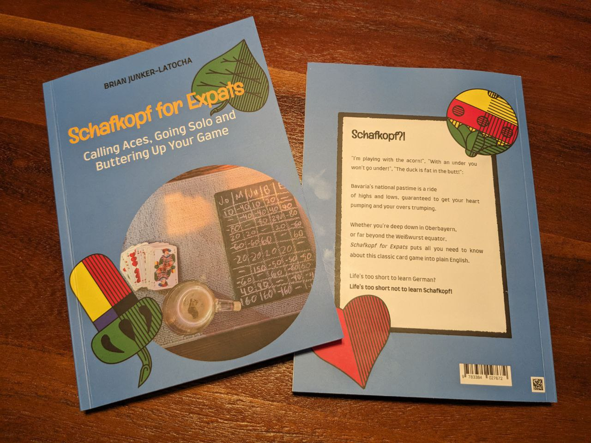

> __Kollaborationskultur, die:__ Das gemeinsame Hinstreben auf im Konsens beschlossene Ziele.   

(Erscheint Ende 2025)

## Schafkopf for Expats

The best (and only) book out there about Bavarian Schafkopf in English! 

### Schafkopf?!

"I'm playing with the acorn!", "With an under you won't go under!", "The duck is fat in the butt!":

Bavaria's national pastime is a ride of highs and lows, guaranteed to get your heart thumping and your overs trumping.

Whether you're deep down in Oberbayern, or far beyond the Weißwurst equator, *Schafkopf for Expats* puts all you need to know about this classic card game into plain English.

Life's too short to learn German?
Life's too short not to learn Schafkopf!

Includes rules for 66, Schnauz, Solitaire and Three-Player Schafkopf.

### Get the book
Starting Dec. 1st, 2023
#### From Germany, Austria or Switzerland

Orderable in your local bookstore from Dec. 1st, 2023:
- 127 pages, paperback
- 18,00€ 
- ISBN 978-3-384-02767-2
- Printing and distribution by tredition Verlag

<a href="https://shop.tredition.com/booktitle/Schafkopf_for_Expats/W-869-807-800">Or directly via tredition Verlag</a>

#### From the internet

You can download a [free courtesy copy](https://junker-latocha.com/assets/schafkopf-junkerlatocha.pdf) here. 
