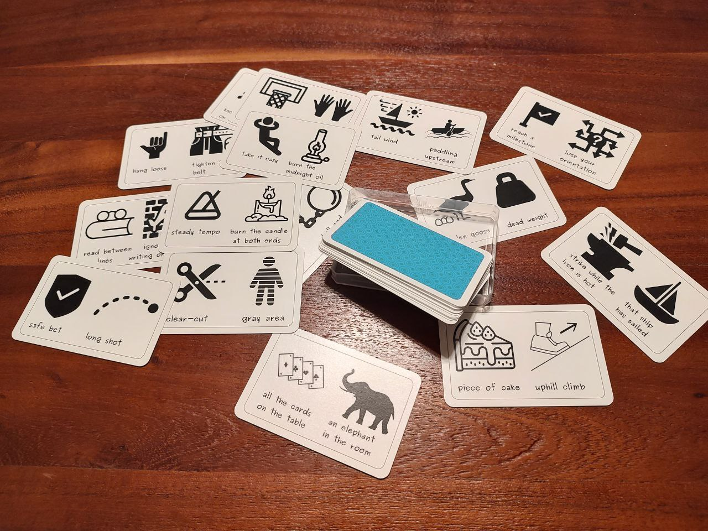

## SINNBILDER 
Ein Bild sagt mehr als tausend Worte – SINNBILDER noch mehr!

> _Sinnbilder:_ anschauliche Objekte und Situationen, die pointierte Analogien schaffen.

SINNBILDER laden zur Reflexion ein. Ob im Berufsleben oder in der Freizeit – sie regen Gespräche über das Wesentliche an und eröffnen neue Blickwinkel.

Mit kraftvollen bildhaften Metaphern entfachen SINNBILDER kommunikative Funken, die Emotionen und Assoziationen wecken.  
Jede Karte präsentiert zwei gegensätzliche Metaphern, um neue Denkanstöße zu geben.

SINNBILDER sind Werkzeuge für echtes Zuhören!

## Presse

