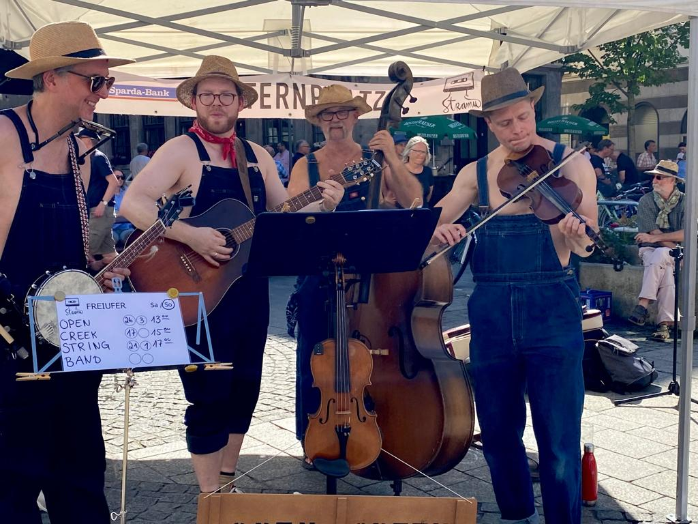

    

(image credit <a href="https://www.felixrosic.de/">Felix Rosić</a>)

Brian Junker-Latocha's rhythmic Americana roots and foot-tapping folkpop melodies are what happens when you put an east-coast American guitar player into the fertile German soil and pour some beer over top.

Rhythm & Rhyme is about bringing that feel-good folk mindset to contemporary originals that keep you looking forward and put a spring in your step while you're at it. 

At the crossroads of americana and country, Brian's debut album goes its own way. You'll find catchy choruses, but also a depth of instrumentation that lends color and contrast. Authentic melodies combine with traditional rhythms to create the ideal roadtrip soundtrack-- whether down the Blue Ridge Parkway-- or across the Autobahn.

So buckle up, turn the key, and crank up the stereo. And let Brian Junker-Latocha make your day a ride to remember.

<iframe style="border-radius:12px" src="https://open.spotify.com/embed/album/5lTDHgvhszQk1KZLF48hSP?utm_source=generator" width="100%" height="352" frameBorder="0" allowfullscreen="" allow="autoplay; clipboard-write; encrypted-media; fullscreen; picture-in-picture" loading="lazy"></iframe>

<a class="bit-widget-initializer" data-artist-name="id_15569458" data-events-to-display="" data-background-color="rgba(255,255,255,1)" data-separator-color="rgba(221,221,221,1)" data-text-color="rgba(66,66,66,1)" data-font="Helvetica" data-auto-style="true" data-button-label-capitalization="uppercase" data-header-capitalization="uppercase" data-location-capitalization="uppercase" data-venue-capitalization="uppercase" data-display-local-dates="true" data-local-dates-position="tab" data-display-past-dates="true" data-display-details="false" data-display-lineup="false" data-display-start-time="false" data-social-share-icon="false" data-display-limit="all" data-date-format="MMM. D, YYYY" data-date-orientation="horizontal" data-date-border-color="#4A4A4A" data-date-border-width="1px" data-date-capitalization="capitalize" data-date-border-radius="10px" data-event-ticket-cta-size="medium" data-event-custom-ticket-text="" data-event-ticket-text="TICKETS" data-event-ticket-icon="false" data-event-ticket-cta-text-color="rgba(255,255,255,1)" data-event-ticket-cta-bg-color="rgba(74,74,74,1)" data-event-ticket-cta-border-color="rgba(74,74,74,1)" data-event-ticket-cta-border-width="0px" data-event-ticket-cta-border-radius="2px" data-sold-out-button-text-color="rgba(255,255,255,1)" data-sold-out-button-background-color="rgba(74,74,74,1)" data-sold-out-button-border-color="rgba(74,74,74,1)" data-sold-out-button-clickable="true" data-event-rsvp-position="hidden" data-event-rsvp-cta-size="medium" data-event-rsvp-only-show-icon="false" data-event-rsvp-text="RSVP" data-event-rsvp-icon="false" data-event-rsvp-cta-text-color="rgba(74,74,74,1)" data-event-rsvp-cta-bg-color="rgba(255,255,255,1)" data-event-rsvp-cta-border-color="rgba(74,74,74,1)" data-event-rsvp-cta-border-width="1px" data-event-rsvp-cta-border-radius="2px" data-follow-section-position="top" data-follow-section-alignment="center" data-follow-section-header-text="Get updates on new shows, new music, and more" data-follow-section-cta-size="medium" data-follow-section-cta-text="FOLLOW" data-follow-section-cta-icon="false" data-follow-section-cta-text-color="rgba(255,255,255,1)" data-follow-section-cta-bg-color="rgba(74,74,74,1)" data-follow-section-cta-border-color="rgba(74,74,74,1)" data-follow-section-cta-border-width="0px" data-follow-section-cta-border-radius="2px" data-play-my-city-position="bottom" data-play-my-city-alignment="center" data-play-my-city-header-text="Don’t see a show near you?" data-play-my-city-cta-size="medium" data-play-my-city-cta-text="REQUEST A SHOW" data-play-my-city-cta-icon="false" data-play-my-city-cta-text-color="rgba(255,255,255,1)" data-play-my-city-cta-bg-color="rgba(74,74,74,1)" data-play-my-city-cta-border-color="rgba(74,74,74,1)" data-play-my-city-cta-border-width="0px" data-play-my-city-cta-border-radius="2px" data-optin-font="" data-optin-text-color="" data-optin-bg-color="" data-optin-cta-text-color="" data-optin-cta-bg-color="" data-optin-cta-border-width="" data-optin-cta-border-radius="" data-optin-cta-border-color="" data-language="en" data-layout-breakpoint="900" data-app-id="" data-affil-code="" data-bit-logo-position="bottomRight" data-bit-logo-color="rgba(66,66,66,1)"></a>

<iframe src="https://discord.com/widget?id=1322496606381277227&theme=dark" width="350" height="500" allowtransparency="true" frameborder="0" sandbox="allow-popups allow-popups-to-escape-sandbox allow-same-origin allow-scripts"></iframe>

## Open Creek Stringband

And don't forget Offenbach am Main's premier old-time group, [Open Creek Stringband](https://opencreekstringband.com)!

<audio src="assets\audio\idontlovenobody.mp3" controls></audio> 

